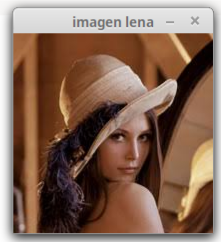

%Santiago Casallas Bohorquez

# Procesamiento Digital de imágenes

## Abrir,mostrar y guardar una imagen

A continuación se va mostrar la forma en que se abre una imagen, en este caso la imagen de llama *imagen.jpg*, para
esto se utiliza el siguiente código:

```

import cv2

#comando para leer imagen
im = cv2.imread("c:/data/lena.jpeg", 1)

# mostrar una imagen
cv2.imshow('imagen lena', im)

#Guardar una imagen
cv2.imwrite("c:/data/lenaGuardada.jpeg",im)

#comando para detener la imagen
cv2.waitKey(0)


```
En `cv2.imread()` ponemos como parámetro el nombre y la dirección de la imagen entre `""` ó `''`  y después $1$ si se quiere abrir la imagen en formato RGB o
$0$ si se quiere abrir la imagen en escala de grises.

La imagen se muestra con el comando `cv2.imshow()`, donde el primer parámetro es el título de la imagen y el siguiente parámetro es
la variable de la imagen.

Para guardar la imagen, se utiliza el comando `cv2.imwrite()`, en donde le damos la dirección en donde se quiere guardar la imagen y la variable de la imagen a guardar.

por último, es necesario, siempre que se abre una ventana, ejecutar el comando `cv2.waitKey()`, el cual tiene como parámetro un valor positivo  que funciona como un *delay* o un tiempo de espera para cerrar la imagen, o un valor $<=0$ cuando se quiere que la ventana de la  imagen esté abierta indefinidamente, para este caso se coloca un 0.

Una vez se ejecuta el código, dará como resultado la siguiente imagen que se muestra en la *figura 1*.




